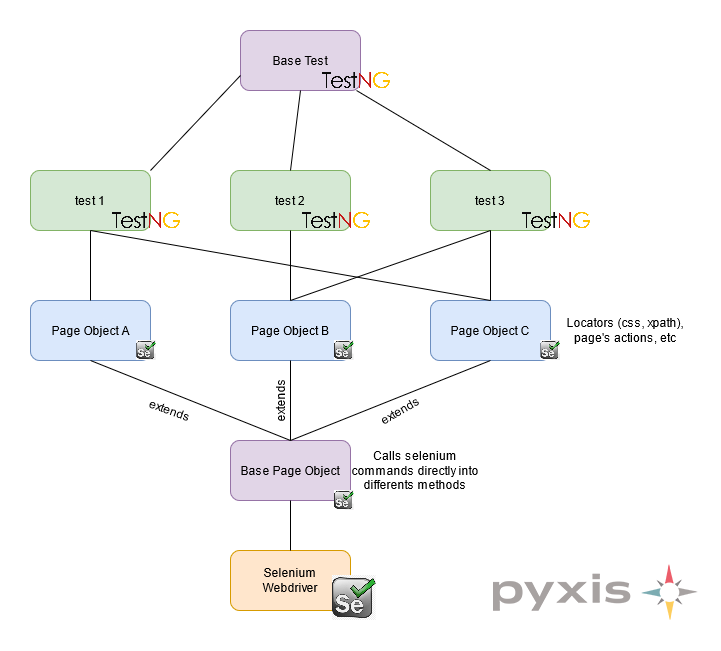

# PRUEBA PYXIS - TRELLO AUTOMATION TEST

Este proyecto es una es un framework de Selenium Webdriver, Maven y testNG. Contiene ademas reportes en ALlure.

El sitio web objetivo es [**Trello**](https://trello.com/)

## Pre requisitos

* Java 8 o superior.
* Maven 

## Ejecutar los test
1. Clonar el proyecto.
2. Ejecutar en el directorio del proyecto el comando

``` sh
mvn test
```

## Arquitectura del proyecto



## Escenario 
La cobertura disponibles para este demo es básica y se basa en el siguiente escenario:

1. Automaticé el siguiente escenario a nivel de interfaz WEB:
2. Login con usuario y password
3. Crear un nuevo Tablero
4. Añadir una lista al nuevo Tablero


## Ambientes

Los ambientes disponibles pueden verse en el archivo configurations.properties, asi como tambien los browser que estan permitidos.

| Ambiente | url
| ------------- | ------------- |
| automation | https://trello.com/ |
| testing  | https://trello.com/  |
| preprod  | https://trello.com/  |

Por defecto el ambiente tomado es automation, pero si se quiere ejecutar en testing por ejemplo ejecutar:

```mvn test -D environment=testing```

## Ejecuciones parametrizadas

A continuación se detalla como ejecutar en diferentes navegadores, ambientes y en modo headless. Si no se especifica nada los valores por defectos son chrome, no headless y el ambiente es automation como se menciono anteriormente.

#### Chrome
```mvn test -D browser=chrome``` o  ```mvn test```
#### Chrome headless
```mvn test -D browser=chrome -D headless=1``` o  ```mvn test -D headless=1```

#### Firefox
```mvn test -D browser=firefox```
#### Firefox headless
```mvn test -D browser=firefox -D headless=1```

#### Edge
```mvn test -D browser=edge```
#### Edge headless
```mvn test -D browser=edge -D headless=1```


## Reportes

Para poder ver el reporte generado por **Allure** ejecutar el comando

```allure serve```

Se creara un servidor web temporal donde se levanta un dashboard generado por la herramienta automaticamente.
Para mas informacion visitar el [sitio](https://docs.qameta.io/allure/#_installing_a_commandline).

Igualmente existe el reporte generado por el plugin [surefire](https://maven.apache.org/surefire/maven-surefire-plugin/). En la carpeta target buscar y abrir el archivo index.html.

## Errores y mejoras conocidas.